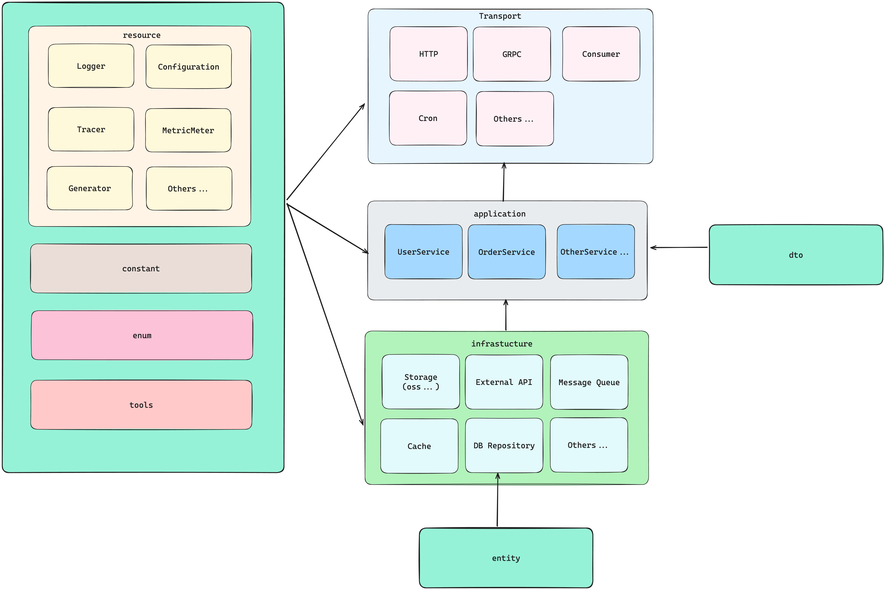

# 介绍

该项目为Go后端的通用模板

# 项目结构

## 包结构依赖图



## 包结构说明

- [infrastructure](infrastructure): 基础设施层. 包含数据库、缓存、消息队列等基础设施的实现. 它被 application 层依赖.
    - [cache](infrastructure%2Fcache): 缓存的实现.
    - [store](infrastructure%2Fstore): 数据库的实现.
        - [client](infrastructure%2Fstore%2Fclient): 数据库客户端的实现.
        - [repository](infrastructure%2Fstore%2Frepository): 数据库仓库.用于查询修改 [entity](model%2Fentity)
- [application](application): 应用层. 这层是应用程序核心的业务实现。核心业务逻辑代码都写在这一层.
- [transport](transport):传输层. 这是对各种类型协议报文的转换验证，监听端口, 接收请求, 调用应用层的服务.例如http,consumer,
  grpc等.
- [resource](resource): 资源层. 它是我们程序运行期间的需要的资源. 比如配置文件,Logger,Tracer,Metric等
    - [config](resource%2Fconfig): 配置的实现
    - [logger](resource%2Flogger): 日志的实现
    - [metric](resource%2Fmetric): 监控指标的实现
    - [tracer](resource%2Ftracer): 链路追踪的实现
    - [validator](resource%2Fvalidator): 参数校验的实现
- [model](model): 数据模型. 这是我们的数据模型层. 用于定义我们的数据结构.
    - [entity](model%2Fentity): 实体对象. 每个数据库表对应一个实体模型.
      被 [repository](infrastructure%2Fstore%2Frepository) 依赖
    - [dto](model%2Fvo): 数据传输对象(data transfer object). 被 [application](application) 依赖. application 层通过 dto
      与 transport 层进行数据交互. dto可以转成各种协议的报文

# 快速开始

## 运行项目

```shell
git clone https://github.com/chaihaobo/go-backend-template
make run
```

## 构建项目

### 适用于当前操作系统

```shell
make 
```

### 生产构建:linux amd64

```shell
make static
```